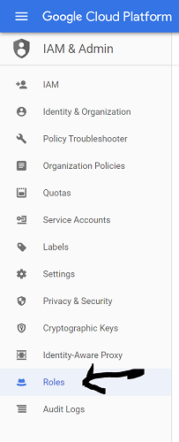
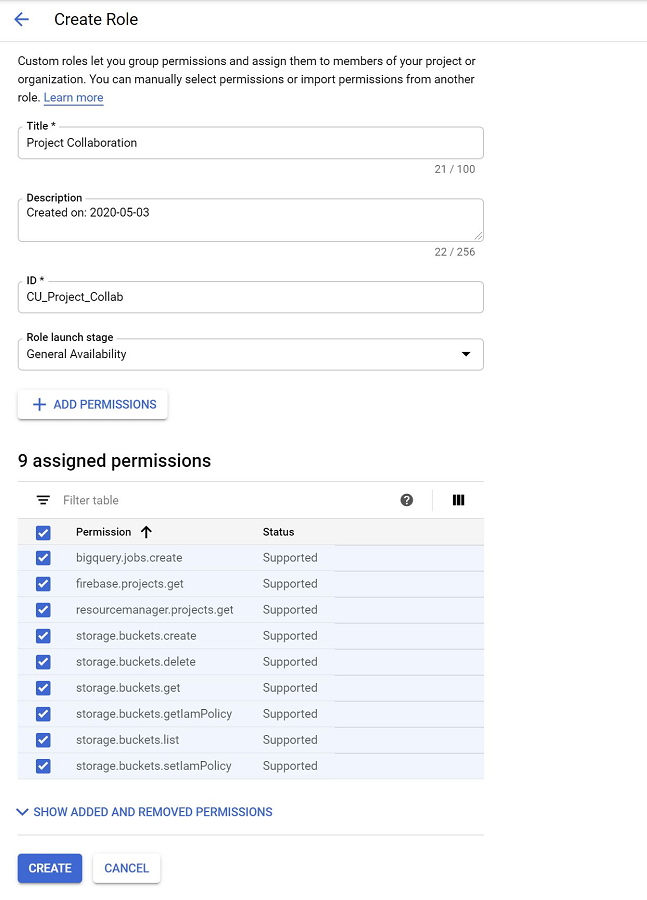
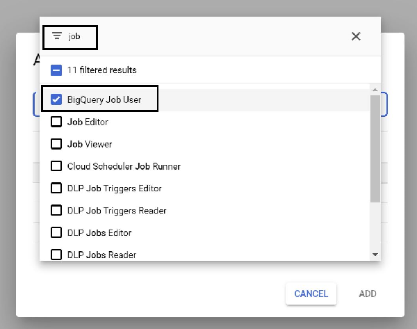
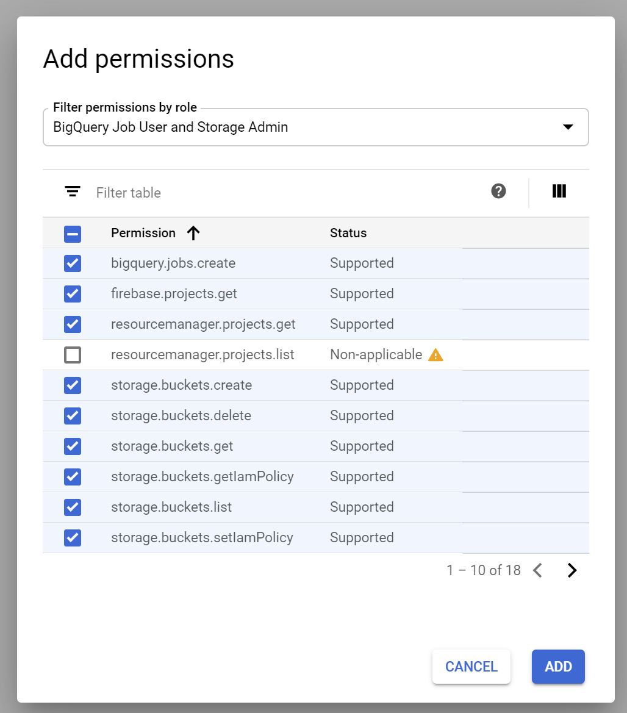
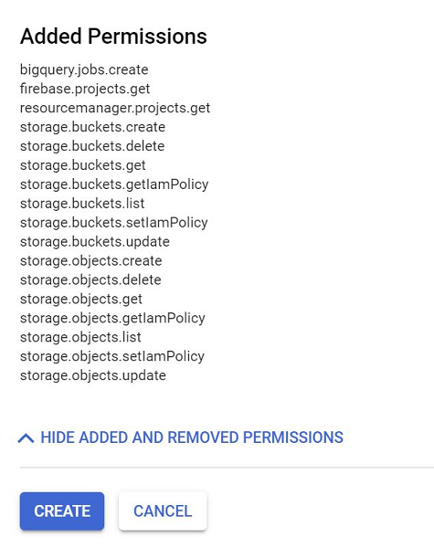
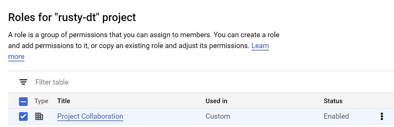
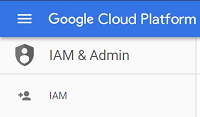
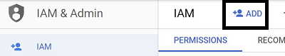
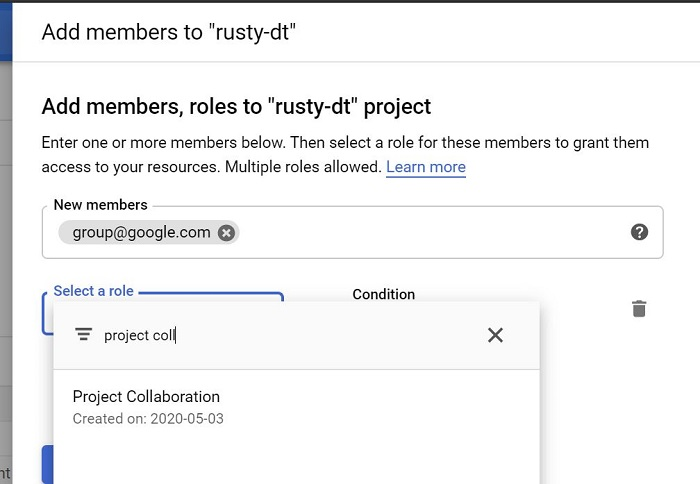
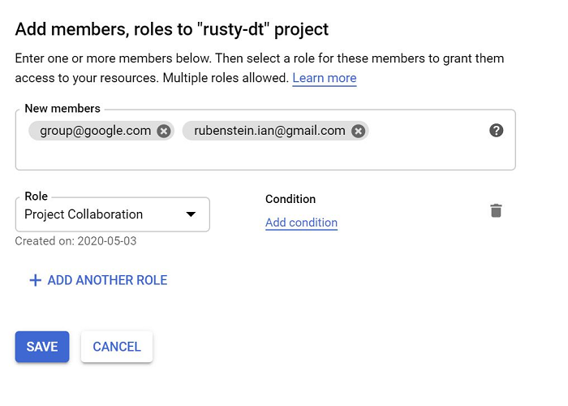

# Roles and IAM

 

#### Roles are a group of permissions
#### IAM - Identity & Access Management
  

## Roles

##### Roles are groups of permissions that can be assigned to an individual or a group. GCP lets users use pre-made Roles or create Custom Roles.
##### This guide will walk through creating a new custom role that can be reused for group projects relying on BigQuery and Google Storage. 

### Start with a Project

The following steps will be easier to follow by staying within the inteded project.

 In the hambuger menu, click <b>IAM & Admin</b> and then <b>Roles</b>

In this screen click <b>CREATE ROLE</b>

 
This is the screen to setup a Custom Role. Provide a descriptive but general name. Descriptive in that it will describe what permissions the role may have, but general enough that the name would make sense to be reused on a future project. The Title should follow these rules, the ID should as well, but must also be unique. 

 
Selecting the correct roles is the whole point of this exercise. We want to give a few high-level types of functionality: 
* <b>BigQuery Admin</b> rights to create and delete tables
* <b>BigQuery Job User</b> rights to use BQ with Colabratory Notebooks.
* <b>Storage Admin</b> to create storage locations to drop data that will be loaded into BigQuery.

Click <b>ADD PERMISSONS</b>

Then search for the <b><i>Role Groups</b></i> we want:

 
Once the right pre-set roles are selected, <b><i>X-out</b></i> of the modal. 

 

Then make sure all the individual permissions are checked. At this point, certain permissions can be excluded. `setIamPolicy` permissions probably are not needed, and following the [principle of least privilege](https://en.wikipedia.org/wiki/Principle_of_least_privilege) is good practice.
It's also not critical that this is done perfectly the first time. <b>Roles</b> can be modified easily, and the effects are almost immediate. (Sometimes the user will need to log out, and sign in again for their new permissions to be honored.)
Once a selection has been made (be sure to click through and enable the permissions on all the pages since only 10 are shown at a time), click <b>ADD</b>. 

The changes that would be applied can be reviewed, and when satisfied, click <b>CREATE</b>. If an existing <b>Role</b> is being edited, click <b>SAVE</b>.

Once saved the new <b>Custom Role</b> will appear in your list of <b>Roles</b>:

Now it can be applied to a group or individual users. 
To use a group, use [Google Groups](https://groups.google.com) to create a group. The next step is the same for a group or an individual user account.

Click into <b>IAM</b> in the <b>IAM & Admin</b> section

Click <b>ADD</b> 

Add any google account (personal) or a group and click to <b>Select a role</b> 
Begin typing the name of the <b>Custom Role</b> created previously and select it. 

  

Add any additional users or groups and click <b>SAVE</b>

Now any users that were just added may need to sign-out and sign-in again for the changes to take effect, but they should be immediate. 